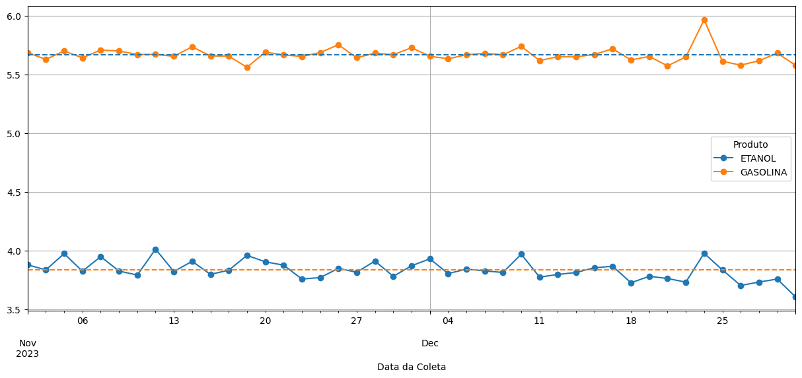
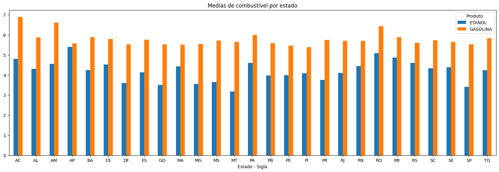
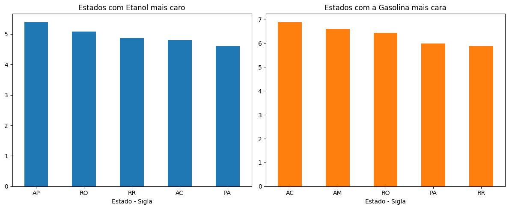
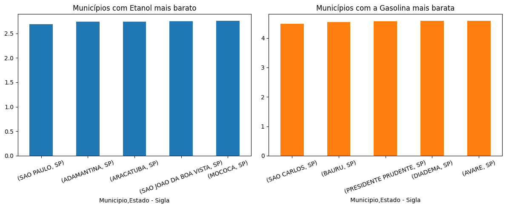
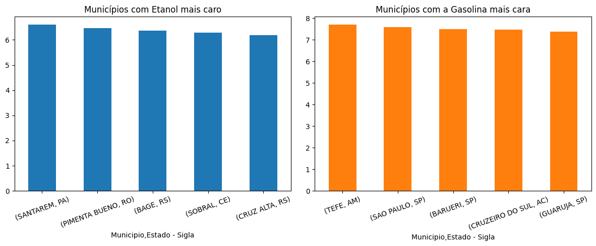
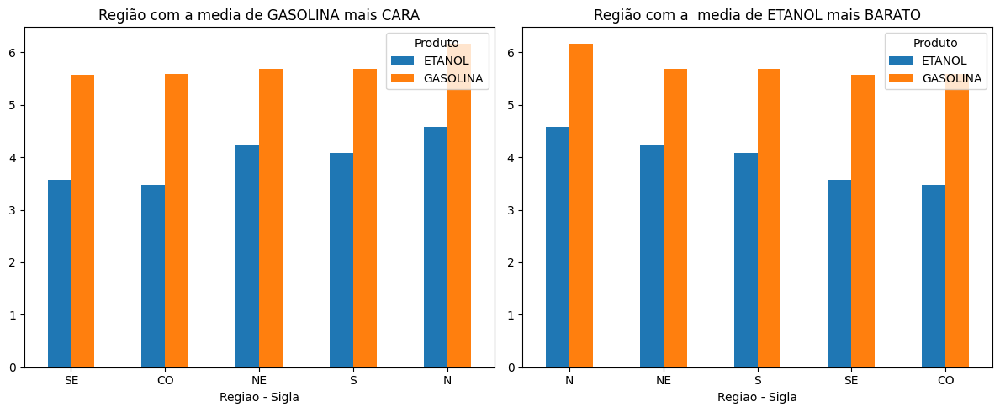
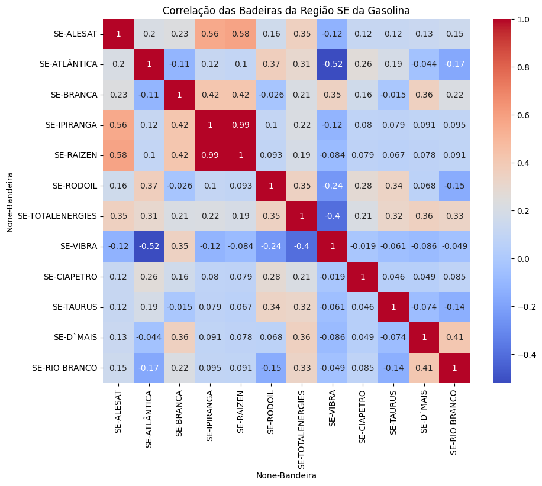
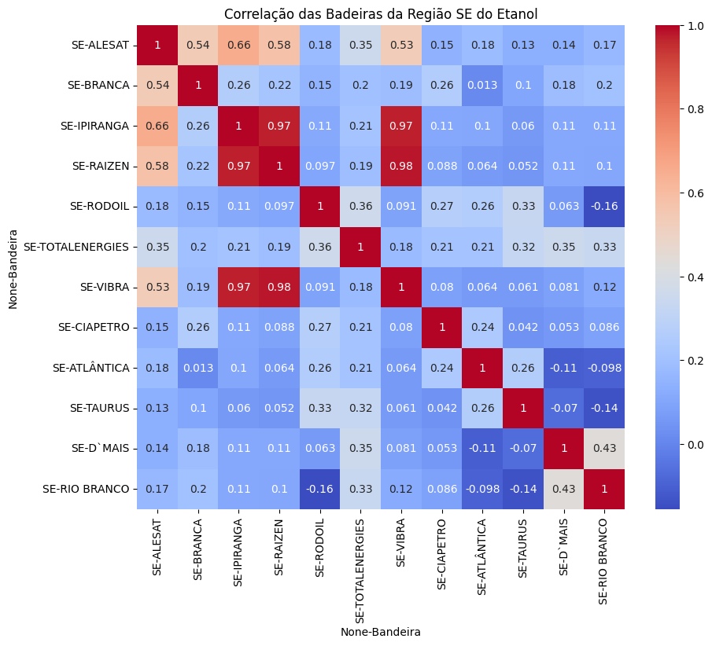
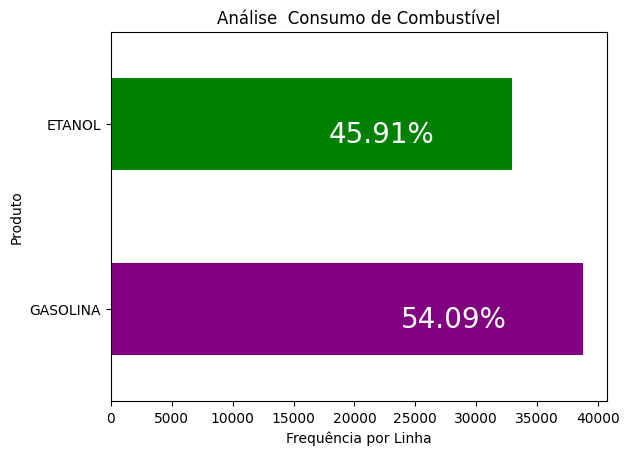

<h1 align="center">
 
</h1>
---

# Projeto 4 - Análise de Preços de Combustíveis

## Conteúdo do Projeto
- [Contexto](#contexto)
- [Estrutura do Projeto](#estrutura-do-projeto)
- [Requisitos](#requisitos)
- [Download](#download)
- [Principais Códigos](#principais-códigos)
- [Resultados e Insights](#resultados-e-insights)
- [Perguntas Adicionais](#perguntas-adicionais)
- [Integrantes](#integrantes)
- [Status](#status)

## Contexto

Este projeto tem como objetivo realizar uma análise exploratória dos preços da gasolina e do etanol nos dois últimos meses do ano atual, utilizando dados disponíveis no portal gov.br. Serão exploradas diversas perguntas relacionadas ao comportamento dos preços, médias por estado, municípios com os menores e maiores preços, correlações entre preços e regiões, entre outras questões adicionais.

## Estrutura do Projeto

- `Data/`: Pasta contendo os arquivos de dados e arquivos para o funcionamento do README.
- `Doc/`: Contém os PDFs do trabalho e arquivos de teste.
- `notebooks/`: Pasta contendo o Jupyter Notebook desenvolvido.
- `presentation/`: Pasta contendo slides de apoio para a apresentação.
- `README.md`: Documentação principal do projeto.

## PDF do Projeto
- [PDF com Instruções e Detalhes do Projeto](Doc/1694464991_SEDadosM4Projetoemgrupopdf.pdf)

## Requisitos

- **Python 3.x:** [Download Python](https://www.python.org/downloads/)
- **Pandas:** Instale com `!pip install pandas`
- **NumPy:** Instale com `!pip install numpy`
- **Matplotlib:** Instale com `!pip install matplotlib`

## Download

[](https://github.com/NewKanvas/Projeto-4/archive/main.zip)

---

## Principais Códigos

1. **Importando Bibliotecas e Carregando os Dados**:

```python
import pandas as pd
import numpy as np

etanol11 = pd.read_csv('../Data/precos-gasolina-etanol-11.csv', sep=';')
etanol12 = pd.read_csv('../Data/precos-gasolina-etanol-12.csv', sep=';')
```

2. **Limpeza e Preparação de Dados**:

```python
df = pd.concat([etanol11, etanol12], ignore_index=True) # Juntando as duas tabelas

df.drop(['Cep', 'CNPJ da Revenda', 'Valor de Compra', 'Unidade de Medida', 'Complemento', 'Numero Rua', 'Nome da Rua'], inplace=True, axis='columns') # Retirando

df = df.reindex(columns=['Regiao - Sigla', 'Estado - Sigla', 'Municipio', 'Bairro', 'Bandeira', 'Revenda', 'Valor de Venda', 'Produto', 'Data da Coleta']) # Reordenando rótulos

df['Data da Coleta'] = pd.to_datetime(df['Data da Coleta'], format='%d/%m/%Y') # Mudando o Formato de Data 

df['Valor de Venda'] = df['Valor de Venda'].str.replace(',', '.').astype(float) # Mudando o Formato do Preço
```

## Resultados e Insights



- Média Bimestral da Gasolina: R$5,67
- Média Bimestral do Etanol: R$3,83

### **Conclusão da Análise**:

Constatamos que houve oscilações de valores.
As maiores oscilações foram no valor do etanol. Sendo que o maior pico foi no valor da gasolina, na semana do Natal.
Verificamos também que os maiores preços tanto do Etanol, quanto da gasolina foram na região norte do país.
Na média geral, houve uma queda na média dos preços.

---



Top 5 Estados com o preço médio mais alto para o Etanol:
- AP: R$5,40
- RO: R$5,09
- RR: R$4,87
- AC: R$4,81
- PA: R$4,61

Top 5 Estados com o preço médio mais alto para a Gasolina:
- AC: R$6,89
- AM: R$6,60
- RO: R$6,44
- PA: R$6,00
- RR: R$5,89

---

O menor preço de gasolina foi registrado em **São Carlos, SP**, no valor de **R$4,49**, enquanto **São Paulo, SP**, apresentou o menor preço para o etanol, a **R$2,69**.



Por outro lado, o município com o maior preço para a gasolina foi **Tefé AM**, atingindo **R$7,70**, enquanto **Santarém, PA**, liderou no preço do etanol, alcançando **R$6,60**.



---



7. **Qual a região que possui o maior valor médio da gasolina?**
   - A região que possui o maior valor médio da gasolina é a região **Norte (N)**, com um valor médio de **R$6,17** por litro.

8. **Qual a região que possui o menor valor médio do etanol?**
   - A região que possui o menor valor médio do etanol é a região **Sudeste (SE)**, com um valor médio de **R$3,57** por litro.
   
---
***O resto do graficos de correlação estão dentro do notebook***
### **Sudoeste Bandeira X Gasolina **


### **Sudoeste Bandeira X Etanol **


***O resto do graficos de correlação estão dentro do notebook***

---

### Perguntas Adicionais

11. **Qual é o combustível mais consumido no Brasil nos últimos dois meses?**



A gasolina continua sendo a preferência de mais de 54% dos consumidores brasileiros, mesmo com o etanol sendo, em média, 32% mais barato. Isso sugere que outros fatores, como a percepção de desempenho e a disponibilidade de postos de abastecimento, também podem influenciar na escolha do combustível.

12. **Os dados dos conjuntos 'etanol' e 'gasolina' apresentam valores atípicos (outliers)? Se sim, verifiquem, se interferem na média do valor nacional?**


Para detectar outliers, inicialmente plotamos um gráfico de boxplot para cada combustível. Os gráficos mostraram outliers em ambos os combustíveis, mas com diferenças significativas.

No gráfico do etanol, os outliers, total de 339, estavam presentes apenas na parte superior. No gráfico da gasolina, os outliers, total de 1107, estavam presentes nas extremidades inferior e superior.


Removemos os outliers usando um código de filtragem.Como não tínhamos outros indicadores, como o total de litros consumidos, que poderiam nos ajudar a avaliar a precisão dos dados, concluímos que a redução no etanol após a remoção dos outliers foi insignificante, de menos de 0,006% para o etanol de aumento. O mesmo aconteceu com a gasolina, que apresentou uma redução de 0,001%.

Portanto, a remoção dos outliers não ipactam diretamente nos valores médios dos combustíveis.


13. **Quais as 5 Bandeiras que tiveram os melhores resultados  em abastecimento no Município do Rio de Janeiro nos dois últimos meses?**


Após uma análise dos resultados obtidos por diferentes bandeiras, foi possível identificar quais foram as que se destacaram. As bandeiras com melhores resultados foram as seguintes:

1. Branca - 280 abastecimentos
2. Vibra - 200 abastecimentos
3. Ipiranga - 175 abastecimentos
4. Raizen - 135 abastecimentos
5. Alesat - 10 abastecimentos   

## Integrantes
[](https://github.com/NewKanvas) [](https://www.linkedin.com/in/cassiosramos/)

[](https://github.com/Hudsoncesar) [](https://www.linkedin.com/in/hudson-cesar-684b50207/)

[](#) [](#)

[](#) [](#)

[](https://github.com/dria99) [](https://www.linkedin.com/in/drielli-ao/)

[](#) [](#)

[](https://trello.com/b/BnXV99YU/projeto-4)

---

## Status


[](./LICENSE)


